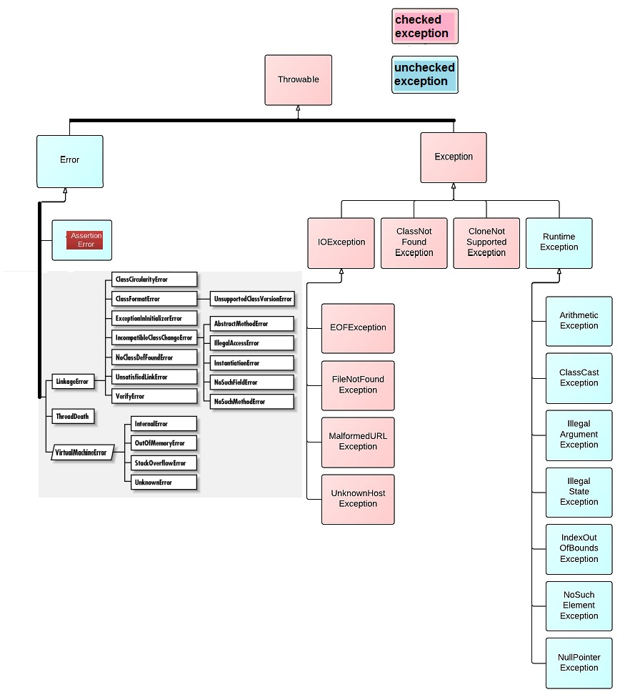

### Exception Hierarchy
All exception classes are subtypes of the java.lang.Exception class. The exception class is a subclass of the Throwable class.
 

### Two types of exceptions:

##### (1) Checked: 
are the exceptions that are checked at compile time. If some code within a method throws a checked exception, 
then the method must either handle the exception or it must specify the exception using throws keyword.

```
import java.io.*; 
  
class Main { 
    //doesn’t compile
    //public static void main(String[] args) { 
    
    //must specify exceptions using throws, or try-catch block
    public static void main(String[] args) throws IOException { 
    //FileNotFoundException is a subclass of IOException
    
        FileReader file = new FileReader("C:\\test\\a.txt"); 
        BufferedReader fileInput = new BufferedReader(file); 
          
        // Print first 3 lines of file "C:\test\a.txt" 
        for (int counter = 0; counter < 3; counter++)  
            System.out.println(fileInput.readLine()); 
          
        fileInput.close(); 
    } 
} 
```

##### (2) Unchecked: 
are the exceptions that are not checked at compiled time. 
(In C++, all exceptions are unchecked, so it is not forced by the compiler to either handle or specify the exception. 
It is up to the programmers to be civilized, and specify or catch the exceptions.)
In Java exceptions under Error and RuntimeException classes are unchecked exceptions, everything else under throwable is checked.

### Common Exceptions
In Java, it is possible to define two catergories of Exceptions and Errors.

(1) JVM Exceptions − These are exceptions/errors that are exclusively or logically thrown by the JVM. 
Examples: NullPointerException, ArrayIndexOutOfBoundsException, ClassCastException.

(2) Programmatic Exceptions − These exceptions are thrown explicitly by the application or the API programmers. 
Examples: IllegalArgumentException, IllegalStateException.

### User-defined Exceptions

(1) If you want to write a checked exception that is automatically enforced by the Handle or Declare Rule, 
you need to extend the `Exception` class. These are considered to be checked exceptions.

(2) If you want to write a runtime exception, you need to extend the `RuntimeException` class.

### Unchecked Exceptions — The Controversy
Because Java does not require methods to catch or to specify unchecked exceptions (RuntimeException, Error, and their subclasses), 
programmers may be tempted to write code that throws only unchecked exceptions or to make all their exception subclasses inherit from 
RuntimeException.
